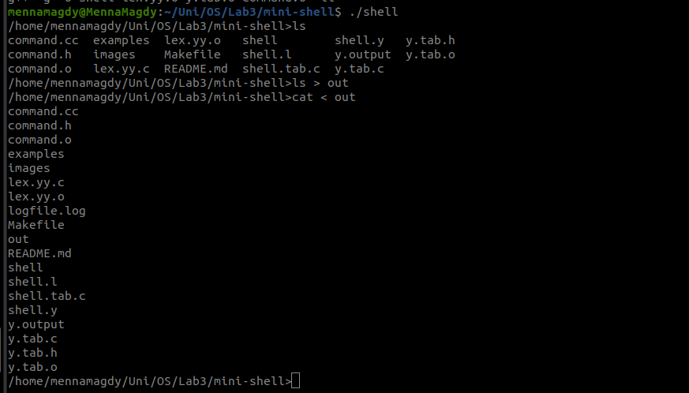

# Mini Shell | Using C, lex and yacc

This project implements a simple command-line shell, capable of running basic shell commands, handling input/output redirection, piping, and background execution of processes.

Tools/ Languages Used:
- C for main execution functions (POSEX standard system calls used)
- Lex for lexical analysis, to tokenize input and handle regex
- Yacc for parsing, to generate the syntax and handle grammar rules for shell commands

## 1. Features
- Basic command execution with attributes(ls, ls -al, pwd, cat, etc..)
- Input/output redirection (cat < input, cat > output, etc..)
- Piping support ( ls | grep "file", etc..)
- Background processes execution (ls /etc &, etc..)
- Change directory support (cd)
- Error handling for invalid commands or redirection
- Processes/ Commands Tracking (in log file)

## 2. Installation Guide

Prerequisite: make sure you have lex, yacc and make installed

1. Clone the repository:

	`git clone <repo_url>`

2. Navigate to the project directory:

    `cd <project_directory>`

3. Clean up the build (Optional):

	`make clean`

4. Build the project:

    `make`

4. Run the shell:

	`./shell`

## 3. Sample Run

TO BE FIXED:
1. cat < out > out2
2. ls /tt >>& out2
3. BONUS | Wildcarding

